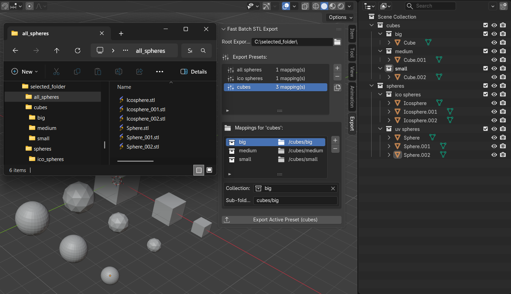

# Blender-fast-stl-batch-exporter-Vibecoded

Vibecoded (caution!) Extension to batch STL export objects in selected collections to selected folder with sub folders. Each preset contains collections with target subfolder where you want to export all objects from specified colelction. Each object saved as separate STL and named same as object. The root directory is main folder which contains all subfolders.
